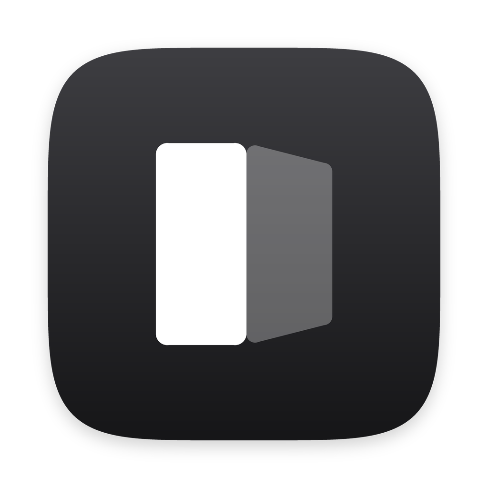

# MacBook Duo

**The iPhone Duo effect, on your Mac.**

Tilt your MacBook's screen and the picture stays put, like it's floating in front of it. MacBook Duo
reads the lid angle sensor in the hinge and redraws the screen for where your eyes are. Turn on
**Screen Effect** and everything on your screen gets the effect as you tilt, then settles back when
you stop.

## Requirements

- MacBook Air (M2 and later), 14- and 16-inch MacBook Pro (2021 and later), or 16-inch MacBook Pro
  (2019): the MacBooks with a lid angle sensor. On other Macs, MacBook Duo says so.
- macOS 14 Sonoma or later.

It isn't on the Mac App Store, because App Store apps can't read the lid sensor.

## Getting started

The welcome shows the effect on a desert scene, then sets up Screen Effect, which needs Screen
Recording permission, and calibration. Calibrating with the camera takes about 10 seconds.

Tip: close one eye. It's even better.

## Using it

- **⌥⌘S** turns Screen Effect on or off, from any app. So does the menu bar.
- **MacBook Duo's window** shows the effect on the desert, with a toolbar: **Re-center** (**R**),
  **Screen Effect**, **Calibrate**, **Controls** (**X**) and **Full Screen** (**F**).
- **Settings** (**⌘,**): open at login, the Dock icon, the shortcut and calibration. **Advanced** has
  motion prediction, your MacBook's lid measurements and the live sensor reading.

Closing the window keeps MacBook Duo in the menu bar.

### Controls

- **Picture**: the desert, a test pattern, or your own image (drop one on the window). Size, corners
  and background.
- **Scene**: the desert's parallax and its clock.
- **Look**: blur and dim, by depth or from an edge.
- **Calibration**: the viewing position, and both ways to calibrate.

### Calibrating

- **Calibrate with Camera** (recommended): face the screen, keep your head still, and slowly tilt
  the screen back and forth.
- **Calibrate by Eye**: line up a target at two lid angles until the circle looks round.

## Privacy

Screen Effect uses Screen Recording only to redraw your screen on the same display. Nothing is
recorded, saved or sent. The camera is used only while calibrating. MacBook Duo makes no network
connections.

## How it works

**The geometry.** MacBook Duo keeps a physical model of your MacBook in centimeters: the display's
real size (as it reports it), the lid angle, and where the display sits on the lid. The hinge turns
around an axis inside the back of the base, and the lid's lower end swings down behind it, so the
glass lies a few millimeters behind that axis and the lit area starts a centimeter and a half or so
up the lid from it: 4 mm and 16.6 mm on a 13-inch MacBook Air, and 5.4 mm and 16 mm on a 14-inch
MacBook Pro, measured from Apple's dimension drawings and product images for each kind of MacBook
(a newer model takes after the one its display's size matches). Advanced settings can override them. The picture is placed in space exactly where the screen showed it when it was centered,
and each frame, every corner is traced from your eye onto the screen at its current angle. A
picture is flat, so tracing its corners is enough: a perspective transform takes it the rest of the
way, pixel for pixel, in the shader.

**The motion.** The sensor reports the lid only ten times a second, on its own steady clock, so
MacBook Duo reads it just around each moment a new value is due, catching each within about a
millisecond and a half at about 38 reads a second, and eases the drawn angle smoothly toward it:
about 90% of the way in a fifth of a second, never past it. Advanced settings can instead predict,
from the last three readings, where the lid will be when each frame reaches the glass: that trails
less while the lid moves (about 0.6° on average on recorded motion, against nearly 4°), but it has
to guess between readings, and overshoots and springs back when the lid stops. Some sensors wobble by a tenth of a degree at rest, so
MacBook Duo learns how much its own does and doesn't take that for motion. When nothing needs the
lid (the window closed and Screen Effect off), the sensor isn't read at all; after sleep, it's
opened again.

**The drawing.** Everything is drawn with Metal, on its own display link, and nothing is drawn
while nothing moves. For each pixel the shader works out where on the picture it is, mixes the
layers there, dims it and shapes it by the picture's outline. With blur, it's the picture of the
whole screen that's blurred, rather than the card: drawn sharp along with how much blur each pixel
should get, then shrunk and blurred into eight progressively blurrier copies, of which each pixel
blends the two nearest its blur. That reads like frosted glass on the screen with the card seen
through it.

**Screen Effect** captures the built-in display live with ScreenCaptureKit
(leaving out its own window) and, while the lid moves, draws it back over itself in a window above
everything that lets clicks through. The capture is drawn in the display's own colors and lands
exactly on its pixels, and the blur and dim always fade out as the screen eases back, so handing
back to the real screen doesn't show. While the lid rests, the window is invisible and the capture
slows to 15 frames a second; it's off entirely during sleep and while the screen is locked.

## Build and run

```bash
./build.sh
```

This builds a universal MacBook Duo (and **Lid**, below) into `build/` and installs copies in
`~/Applications`. It needs Xcode, for the Swift and Metal compilers. `ARCHS=arm64 ./build.sh` builds
for Apple silicon only, which is quicker; `INSTALL=0` skips installing.

The build signs the app with your Developer ID certificate if you have one, otherwise your Apple
Development certificate, so the Screen Recording permission outlasts rebuilds; failing both, ad hoc.
It uses the hardened runtime with one entitlement, the camera, for calibrating by camera.

### Releasing

```bash
./package.sh
```

This makes `build/MacBook Duo <version>.dmg`. To hand it out, sign with a Developer ID Application
certificate and have Apple notarize it: store your notarization credentials once with
`xcrun notarytool store-credentials <profile>`, then run `NOTARY_PROFILE=<profile> ./package.sh`,
which notarizes, staples and checks the disk image. The version is `VERSION` in `build.sh`; the
build number is the commit count.

### The code

- `Sources/Shared/LidSensor.swift` and `LidPrediction.swift`: reading the sensor, and the motion
  prediction.
- `Sources/MacBookDuo/`: the app. `Projection.swift` is the geometry; `DeviceSupport.swift` what
  kind of Mac this is and its lid's shape; `CardScene.swift`, `CardRenderer.swift` and
  `CardScene.metal` the drawing; `StillScreen.swift` and `ScreenMirror.swift` Screen Effect;
  `Onboarding.swift`, `MainView.swift`, `Showcase.swift`, `Settings.swift` and `MenuBar.swift`
  the interface; `Defaults.swift` the settings it starts with.

## Lid

A small companion experiment: it fills its window with a color driven by the lid angle, blended in
OKLab. **Dawn** goes from night with the lid nearly closed to full sun wide open; **Spectrum** sweeps
the hues. Click to switch.
